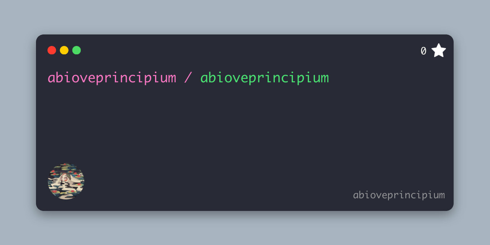

# 💫 About Me:
🔭 I’m currently working on my master’s degree (and figuring things out along the way). 📡 I’m looking to collaborate on SDR projects and innovative telecom solutions. 🌱 I’m currently learning Python for signal processing ⚡ "Everything in life is vibration." – A. Einstein.

## 🌐 Socials:
  

# 💻 Tech Stack:

 
 
 
 
 
 
 
 
 
 

# 📊 GitHub Stats:

---

